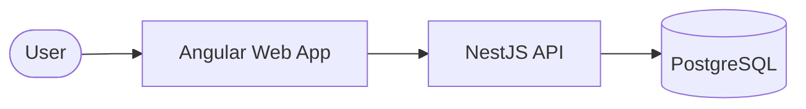

# Enterprise Platform: CRM, Tasks & Pipeline Management

[](https://github.com/qurban7860/NestJS-Angular-Enterprise-CRM-SaaS-Platform)
[](LICENSE)

An all-in-one, multi-tenant enterprise solution for managing CRM contacts, deal pipelines, and team tasks. Built with a focus on high-performance architecture, security, and a premium user experience.

## 🌟 Project Overview

This platform provides a comprehensive suite of tools for modern businesses:
- **CRM Module**: Manage contacts, companies, and relationship history.
- **Deal Pipeline**: A visual Kanban board for tracking sales stages and conversion.
- **Task Management**: A robust system for team assignments, priority tracking, and board views.
- **Enterprise Core**: Integrated authentication, file attachments, and multi-tenant isolation.

## 🏗️ System Architecture

The project is split into two main components:
1. **Frontend**: Angular 17+ with NgRx for state management and a premium glassmorphism UI.
2. **Backend**: NestJS with Prisma ORM and PostgreSQL for a scalable, type-safe API.



## 🚀 Quick Start (Monorepo Setup)

To get the entire platform running locally, follow these steps:

### 1. Prerequisites
- **Node.js**: v18 or higher
- **PostgreSQL**: Running instance
- **npm**: v9 or higher

### 2. Backend Setup
```bash
cd backend
npm install
# Configure .env with your DATABASE_URL
npx prisma migrate dev
npm run start:dev
```

### 3. Frontend Setup
```bash
cd frontend
npm install
ng serve
```

The application will be available at `http://localhost:4200`, and the API documentation at `http://localhost:3000/api/docs`.

## 🛠️ Technology Stack

| Layer | Technologies |
| :--- | :--- |
| **Frontend** | Angular 17, NgRx, Tailwind CSS, RxJS, CDK |
| **Backend** | NestJS, TypeScript, Passport.js, Swagger |
| **Database** | PostgreSQL, Prisma ORM |
| **Infrastructure** | Docker (Optional), JWT Auth, File Streaming |

## 📁 Repository Structure

```text
.
├── backend/            # NestJS API source code
│   ├── src/            # Core application logic (DDD)
│   ├── prisma/         # Database schema and migrations
│   └── README.md       # Backend-specific documentation
├── frontend/           # Angular application source code
│   ├── src/app/        # Features, Core, and Shared modules
│   ├── src/assets/     # Styling and static assets
│   └── README.md       # Frontend-specific documentation
└── README.md           # This project overview
```

## 🤝 Contributing

1. Fork the Project
2. Create your Feature Branch (`git checkout -b feature/AmazingFeature`)
3. Commit your Changes (`git commit -m 'Add some AmazingFeature'`)
4. Push to the Branch (`git push origin feature/AmazingFeature`)
5. Open a Pull Request

## 📜 License

Distributed under the MIT License. See `LICENSE` for more information.

---
*Built with ❤️ for Enterprise Productivity.*
